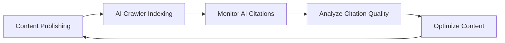

# Awesome GEO [](https://awesome.re)

> Generative Engine Optimization (GEO) — optimizing content for AI-powered search engines and LLM-based answer engines like ChatGPT, Perplexity, Claude, and Google AI Overviews.

<p align="center">
  <a href="README.md">English</a> | <a href="README_CN.md">中文</a>
</p>

## Contents

- [Learning Resources](#learning-resources)
- [Tools & Platforms](#tools--platforms)
- [AI Search Engines](#ai-search-engines)
- [GEO Strategies & Best Practices](#geo-strategies--best-practices)
- [Analytics & Monitoring](#analytics--monitoring)
- [Case Studies](#case-studies)
- [Communities & Forums](#communities--forums)
- [News & Trends](#news--trends)
- [Books](#books)
- [GEO Checklist](#geo-checklist)


## Learning Resources

### Research Papers

- [GEO: Generative Engine Optimization](https://arxiv.org/abs/2311.09735) - Groundbreaking research paper from Princeton University that systematically introduces the GEO concept, demonstrating up to 40% visibility improvements.
- [Generative Engine Optimization: How to Dominate AI Search](https://arxiv.org/abs/2509.08919) - Comprehensive 2025 study revealing AI search engines' systematic bias toward earned media over brand-owned content.
- [AutoGEO: What Generative Search Engines Like and How to Optimize Web Content Cooperatively](https://openreview.net/forum?id=K8EinVWtUB) - ICLR 2026 paper introducing AutoGEO, a framework that automatically learns generative engine preferences and extracts optimization rules.
- [E-GEO: A Testbed for Generative Engine Optimization in E-Commerce](https://arxiv.org/abs/2511.20867) - First e-commerce-specific GEO benchmark with 7,000+ product queries, evaluating 15 rewriting heuristics.
- [Large Language Models for Information Retrieval](https://arxiv.org/abs/2308.07107) - Research on LLM applications in information retrieval.
- [Retrieval-Augmented Generation for Knowledge-Intensive NLP Tasks](https://arxiv.org/abs/2005.11401) - RAG technology paper, fundamental to understanding how AI search engines work.
- [BRIGHT: A Realistic and Challenging Benchmark for Reasoning-Intensive Retrieval](https://arxiv.org/abs/2407.12883) - Benchmark for evaluating retrieval in reasoning-heavy AI search scenarios.
- [Search-o1: Agentic Search-Enhanced LLM Reasoning](https://arxiv.org/abs/2501.05366) - Framework combining agentic RAG with LLM reasoning for complex search tasks.
- [Is ChatGPT Good at Search?](https://arxiv.org/abs/2304.09542) - Empirical evaluation of ChatGPT's search quality, providing insights into optimizing for conversational AI.

### Articles & Guides

- [Mastering Generative Engine Optimization in 2026: Full Guide](https://searchengineland.com/mastering-generative-engine-optimization-in-2026-full-guide-469142) - Search Engine Land's comprehensive 2026 GEO guide covering strategy, measurement, and implementation.
- [Generative Engine Optimization (GEO): How to Win in AI Search](https://backlinko.com/generative-engine-optimization-geo) - Backlinko's data-backed GEO guide with practical optimization strategies.
- [Generative Engine Optimization (GEO): A Marketer's Guide in 2026](https://www.webfx.com/blog/ai/generative-engine-optimization/) - WebFX's marketer-focused GEO guide.
- [Complete Guide to Generative Engine Optimization (GEO) 2026](https://www.promptmonitor.io/blog/generative-engine-optimization) - Step-by-step GEO implementation guide with measurement framework.
- [What is Generative Engine Optimization (GEO)?](https://www.searchenginejournal.com/generative-engine-optimization-geo/) - Search Engine Journal's beginner guide to GEO.
- [How to Optimize for AI Search Engines](https://www.semrush.com/blog/ai-seo/) - Semrush's AI SEO optimization guide.
- [The Rise of Answer Engines](https://moz.com/blog/answer-engine-optimization) - Moz's in-depth analysis on answer engine optimization.
- [Optimizing Content for ChatGPT and AI Assistants](https://ahrefs.com/blog/ai-seo/) - Ahrefs' AI content optimization strategies.
- [How to Optimize for Google AI Overviews 2026](https://becomingseo.com/insights/aeo-geo/optimize-for-google-ai-overviews/) - Comprehensive guide to optimizing for Google AI Overviews.

### Video Tutorials
- [Forget SEO Hacks — GEO Is About Credibility, Clarity, and Control](https://www.youtube.com/watch?v=-PFBgavuFrs) - In-depth GEO strategy focusing on building AI visibility through authority.
- [How to Win in Generative Engine Optimization (GEO): Playbook from +30 Sites](https://www.youtube.com/watch?v=JMaDW1uOzY0) - Embarque's practical GEO framework with real case study data (27K+ AI visits).
- [How to Rank in ChatGPT (SearchGPT SEO Guide 2026)](https://www.youtube.com/watch?v=0wF7Fru91Cw) - Step-by-step checklist for ranking in ChatGPT, Perplexity, and AI search engines.
- [LLM SEO: How to Get Mentioned First on ChatGPT, Perplexity, and Grok](https://www.youtube.com/watch?v=gLawGsda_1s) - Practical walkthrough of content strategies for AI search engine visibility.

### Podcasts

- [Marketing Against the Grain](https://www.hubspot.com/marketing-against-the-grain) - HubSpot marketing podcast, frequently discussing AI marketing and GEO topics.
- [SEOFOMO Weekly](https://seofomo.co/) - Aleyda Solis' weekly SEO & AI search newsletter with podcast episodes.


## Tools & Platforms

### AI Search Engine Monitoring

| Tool               | Description                                                                                                                                     | Link                                             |
| ------------------ | ----------------------------------------------------------------------------------------------------------------------------------------------- | ------------------------------------------------ |
| **Geol.ai**        | First comprehensive GEO platform with automated monitoring, 50+ factor Quality Scoring Engine, and CMS integrations (WordPress, Shopify, Wix)   | [geol.ai](https://geol.ai)                       |
| **OptimizeGEO**    | AI search marketing intelligence platform tracking visibility score, share of voice, sentiment across AI platforms (ISO 27001, SOC 2 compliant) | [optimizegeo.ai](https://www.optimizegeo.ai)     |
| **Conductor**      | End-to-end enterprise AEO platform, combining AEO/GEO and traditional SEO                                                                       | [conductor.com](https://www.conductor.com)       |
| **Contently**      | Content creation, optimization, and AI visibility tracking in one system                                                                        | [contently.com](https://contently.com)           |
| **Profound**       | Deep geo-analysis with multi-language support for AI brand visibility                                                                           | [profound.ai](https://profound.ai)               |
| **Otterly.AI**     | AI search engine ranking tracker                                                                                                                | [otterly.ai](https://otterly.ai)                 |
| **Peec AI**        | Analyze brand mentions in AI search                                                                                                             | [peec.ai](https://peec.ai)                       |
| **Ezeo**           | AI-powered SEO, GEO & AEO platform tracking ChatGPT, Claude, Perplexity, Gemini, Grok, and Reddit                                               | [ezeo.ai](https://ezeo.ai)                       |
| **Prompt Monitor** | Track and optimize AI search performance with prompt-level analytics                                                                            | [promptmonitor.io](https://www.promptmonitor.io) |
| **Knowatoa**       | AI search visibility analytics platform                                                                                                         | [knowatoa.com](https://knowatoa.com)             |
| **SEOTalos**       | Best for AI Mode & AIO Tracking                                                                                                                 | [seotalos.com](https://seotalos.com)             |
| **WorkDuo.ai**     | Best for quick implementation for teams new to AI search optimization                                                                           | [workduo.ai](https://workduo.ai)                 |
| **Quattr**         | Execution-focused SEO platform that connects traditional search performance with emerging AI visibility signals                                 | [quattr.com](https://quattr.com)                 |
| **Surfeo**         | AI-powered GEO platform for SMBs; tracks brand visibility across ChatGPT, Gemini, Perplexity & Claude with content generation, audits, and scoring | [surfeo.ai](https://surfeo.ai)                   |

### Content Optimization Tools

| Tool                | Description                                                                                                                         | Link                                             |
| ------------------- | ----------------------------------------------------------------------------------------------------------------------------------- | ------------------------------------------------ |
| **Clearscope**      | AI-powered content optimization platform                                                                                            | [clearscope.io](https://clearscope.io)           |
| **Surfer SEO**      | Content optimization and SERP analysis                                                                                              | [surferseo.com](https://surferseo.com)           |
| **MarketMuse**      | AI content strategy platform                                                                                                        | [marketmuse.com](https://marketmuse.com)         |
| **Frase**           | Agentic SEO & GEO platform with AI research, content creation, and real-time GEO scoring across ChatGPT, Perplexity, Claude, Gemini | [frase.io](https://frase.io)                     |
| **NeuronWriter**    | NLP-based content optimization                                                                                                      | [neuronwriter.com](https://neuronwriter.com)     |
| **Writesonic**      | AI content generation platform with AEO features.                                                                                   | [writesonic.com](https://writesonic.com)         |
| **Answer Socrates** | Best for GEO Keyword Discovery                                                                                                      | [answersocrates.com](https://answersocrates.com) |

### Brand Monitoring

| Tool           | Description                           | Link                                     |
| -------------- | ------------------------------------- | ---------------------------------------- |
| **Brand24**    | Social media and web brand monitoring | [brand24.com](https://brand24.com)       |
| **Mention**    | Real-time media monitoring            | [mention.com](https://mention.com)       |
| **Brandwatch** | Consumer intelligence platform        | [brandwatch.com](https://brandwatch.com) |
| **Talkwalker** | Social listening and analytics        | [talkwalker.com](https://talkwalker.com) |

### Structured Data Tools

| Tool                         | Description                                             | Link                                                                        |
| ---------------------------- | ------------------------------------------------------- | --------------------------------------------------------------------------- |
| **Schema.org**               | Structured data standards                               | [schema.org](https://schema.org)                                            |
| **Google Rich Results Test** | Test structured data                                    | [Google Tool](https://search.google.com/test/rich-results)                  |
| **Schema Markup Generator**  | Structured data generator                               | [technicalseo.com](https://technicalseo.com/tools/schema-markup-generator/) |
| **Schema Pro**               | WordPress plugin for automated Schema markup generation | [wpschema.com](https://wpschema.com)                                        |

### AI Citation & Visibility Analytics

| Tool | Description | Link |
|------|-------------|------|
| **Maximus Labs** | AI visibility analytics tracking brand mentions and citations across 10+ AI platforms | [maximuslabs.ai](https://www.maximuslabs.ai) |
| **Seer Interactive AI Tools** | AI-powered search analytics suite for understanding AI citation patterns | [seerinteractive.com](https://www.seerinteractive.com) |
| **Originality.ai** | AI content detection and optimization tool ensuring content authenticity for AI search | [originality.ai](https://originality.ai) |
| **BrightEdge AI Search** | Enterprise platform tracking AI search visibility across Google AI Overviews and Bing Copilot | [brightedge.com](https://www.brightedge.com) |
| **seoClarity** | AI-powered platform with GEO analytics module for enterprise content optimization | [seoclarity.net](https://www.seoclarity.net) |
| **Botify** | Enterprise SEO platform with AI search readiness scoring and crawl optimization | [botify.com](https://www.botify.com) |
| **Foglift** | AI-powered GEO readiness scanner analyzing llms.txt, structured data, crawlability, and AI search visibility. Free scan with API and MCP server | [foglift.io](https://foglift.io) |


## AI Search Engines

### Conversational AI Search

| Platform           | Description                                                                                      | Link                                                   |
| ------------------ | ------------------------------------------------------------------------------------------------ | ------------------------------------------------------ |
| **ChatGPT Search** | OpenAI's conversational AI with integrated web search, available to all users since Feb 2025     | [chatgpt.com](https://chatgpt.com)                     |
| **Perplexity AI**  | AI-powered answer engine with real-time web search and source attribution                        | [perplexity.ai](https://perplexity.ai)                 |
| **Grok**           | xAI's AI assistant with DeepSearch for real-time multi-turn reasoning across web and X (Twitter) | [x.ai/grok](https://x.ai/grok)                         |
| **Claude**         | Anthropic's AI assistant with web search capabilities                                            | [claude.ai](https://claude.ai)                         |
| **Gemini**         | Google's multimodal AI with deep Google Search integration                                       | [gemini.google.com](https://gemini.google.com)         |
| **Copilot**        | Microsoft's AI assistant powered by GPT-4 with Bing integration                                  | [copilot.microsoft.com](https://copilot.microsoft.com) |
| **DeepSeek AI**    | DeepSeek's AI assistant, known for strong research and reasoning capabilities                    | [deepseek.com](https://www.deepseek.com)               |

### AI-Enhanced Search

| Platform                | Description                                  | Link                                         |
| ----------------------- | -------------------------------------------- | -------------------------------------------- |
| **Google AI Overviews** | AI-generated summaries in Google Search      | [google.com](https://google.com)             |
| **Bing Chat**           | Bing search integrated with GPT-4            | [bing.com](https://bing.com)                 |
| **You.com**             | AI-first search engine                       | [you.com](https://you.com)                   |
| **Kagi**                | Paid ad-free search engine with AI summaries | [kagi.com](https://kagi.com)                 |
| **Brave Search**        | Privacy-first search engine with AI features | [search.brave.com](https://search.brave.com) |

### Domain-Specific AI Search

| Platform      | Domain                                               | Link                                         |
| ------------- | ---------------------------------------------------- | -------------------------------------------- |
| **Consensus** | Academic research                                    | [consensus.app](https://consensus.app)       |
| **Elicit**    | Scientific literature                                | [elicit.org](https://elicit.org)             |
| **Phind**     | Developer search                                     | [phind.com](https://phind.com)               |
| **Metaphor**  | Semantic search API                                  | [metaphor.systems](https://metaphor.systems) |
| **Tavily**    | AI-native search API for agents and RAG applications | [tavily.com](https://tavily.com)             |
| **Hebbia**    | AI-powered enterprise document search and analysis   | [hebbia.com](https://www.hebbia.com)         |
| **Liner**     | AI-powered academic and research search engine       | [liner.ai](https://liner.ai)                 |
| **SearchGPT** | OpenAI's experimental standalone AI search interface | [searchgpt.com](https://searchgpt.com)       |


## GEO Strategies & Best Practices

### Key Industry Data

| Data Point                                                    | Value                                               | Source                                            |
| ------------------------------------------------------------- | --------------------------------------------------- | ------------------------------------------------- |
| AI search visitor conversion rate vs. traditional organic     | **4.4x higher**                                     | Semrush AI Search Study                           |
| Projected year AI search traffic surpasses traditional search | **2028** (sooner if Google AI Mode becomes default) | Semrush AI Search Study                           |
| AI referral visits (June 2025)                                | **~1.13 billion**, 357% YoY growth                  | AI Referral Traffic Research                      |
| ChatGPT share of AI referral traffic                          | **85.79%**                                          | Semrush AI Traffic Data                           |
| ChatGPT citations from Google positions 21+                   | **~90%**                                            | Semrush AI Search Study                           |
| AI Overviews appearance rate                                  | **~15%** of keywords                                | [Semrush Sensor](https://www.semrush.com/sensor/) |
| Brand mentions prevalence in AI responses                     | **26-39%** of non-branded queries                   | Semrush AI Mentions Study                         |
| B2B AI search conversion rate vs. traditional                 | **6-27x higher**                                    | Backlinko 2025 Analysis                           |

### AI Search Impact on the Buyer Journey

| Stage             | Example Prompt                                                     | AI Response Value                                                  | Brand Opportunity                      |
| ----------------- | ------------------------------------------------------------------ | ------------------------------------------------------------------ | -------------------------------------- |
| **Awareness**     | "What are the best men's running shoe brands?"                     | Brand gets mentioned early in the response                         | Brand exposure and initial awareness   |
| **Consideration** | "Compare top 3 men's running shoe brands for durability and style" | AI compares brands, provides options beyond a single webpage       | Shape perception in real conversations |
| **Decision**      | "Where can I buy these running shoes today?"                       | AI recommends products and brands, directly influencing decisions  | Direct conversion influence            |
| **Purchase**      | "Share reviews for this brand and product"                         | AI surfaces user reviews and word-of-mouth, increasing credibility | Long-term authority asset              |
| **Advocacy**      | "Best deals on men's running shoes in my area"                     | AI recommends purchase options (GPT Shopping)                      | Conversion from recommendations        |

### Content Strategy

#### Content Creation Principles

| Principle             | Key Actions                                                                                                                                   |
| --------------------- | --------------------------------------------------------------------------------------------------------------------------------------------- |
| **Authority**         | Cite reliable sources and research data; include original research and first-party data; demonstrate professional credentials and experience. |
| **Quotability**       | Create clear, concise definitions and explanations; use easily extractable paragraph structures; provide statistics and specific facts.       |
| **Comprehensiveness** | Cover all aspects of the topic in depth; answer potential follow-up questions; provide practical how-to guides.                               |
| **Structure**         | Use clear heading hierarchies; organize information with lists and tables; implement Schema markup.                                           |

#### Content Type Optimization

```markdown
✅ Content types suitable for GEO:
- In-depth guides and tutorials
- Original research reports
- Expert opinions and analysis
- Data-driven articles
- FAQ and Q&A content
- Term definitions and explanations

❌ Content types not suitable for GEO:
- Thin and duplicate content
- Purely sales-oriented content
- Outdated or unupdated information
- Unsourced opinions
```

#### Content Types Most Likely to Earn AI Citations

> Source: Semrush — What Are AI Citations & How Do I Get Them?

| Content Type           | Description                                                               | Why It Works                                                             |
| ---------------------- | ------------------------------------------------------------------------- | ------------------------------------------------------------------------ |
| **Original Research**  | Studies that answer previously unanswered questions                       | LLMs can use your evidence to support specific claims                    |
| **Case Studies**       | In-depth stories demonstrating success of a product, service, or strategy | LLMs can use your case studies to support specific recommendations       |
| **Thought Leadership** | Articles expressing original ideas or opinions to influence others        | LLMs often want to share unique and diverse perspectives                 |
| **News Content**       | Up-to-date, accurate articles about current or ongoing events             | LLMs can't rely on pre-trained data for recent events                    |
| **Brand Content**      | High-quality content about your business and offerings                    | LLMs trust you to provide the most accurate information about your brand |

Tips for making content LLM-friendly:
- Write sentences and paragraphs that make sense in isolation ("chunkable" content).
- Structure content with descriptive subheadings using proper HTML heading tags.
- Add useful images and videos for multimedia citations.
- Mention relevant entities and concepts to boost semantic relevance.
- Avoid poetic, vague, or ambiguous language that NLP systems struggle to interpret.

### Technical Optimization

#### FAST Framework for AI Crawlability

> Source: Semrush — Why Site Health Is Vital For AI Search Visibility

The FAST framework helps teams assess their AI crawler readiness:

| Dimension          | Question                                                    | Key Actions                                                                                                |
| ------------------ | ----------------------------------------------------------- | ---------------------------------------------------------------------------------------------------------- |
| **F - Fetchable**  | Can AI retrieve and read your HTML without rendering?       | Test pages with JavaScript off; ensure core info is in initial HTML; implement SSR                         |
| **A - Accessible** | Is key content understandable without executing scripts?    | Include alt text and captions; use proper heading hierarchies (H1-H6); use semantic HTML5 elements         |
| **S - Structured** | Are you using schema, semantic tags, and clear hierarchies? | Create content layers with definition boxes; use Product/Article/Organization schema; implement FAQ schema |
| **T - Trim**       | Are you sending what's needed, no bloat, no noise?          | Clean up unnecessary tracking scripts; compress assets and optimize images; minimize JS dependencies       |

> Quick tip: Load your top 20 pages with JavaScript disabled. What you see is approximately what AI search crawlers see.

#### Technical GEO Checklist

- [ ] Implement Schema.org structured data
- [ ] Optimize page load speed
- [ ] Ensure mobile-friendliness
- [ ] Use semantic HTML
- [ ] Create XML sitemap
- [ ] Configure robots.txt to allow AI crawlers
- [ ] Create llms.txt for structured AI-readable site information
- [ ] Implement HTTPS
- [ ] Optimize image alt text
- [ ] Ensure server-side rendering for AI crawler accessibility

#### AI Crawler Configuration

```robots.txt
# Allow major AI search crawlers (affect real-time AI responses)
User-agent: GPTBot
Allow: /

User-agent: OAI-SearchBot
Allow: /

User-agent: ChatGPT-User
Allow: /

User-agent: ClaudeBot
Allow: /

User-agent: PerplexityBot
Allow: /

User-agent: Google-Extended
Allow: /

User-agent: Applebot-Extended
Allow: /

# Allow AI training crawlers (affect future model training)
User-agent: CCBot
Allow: /

User-agent: anthropic-ai
Allow: /

User-agent: Bytespider
Allow: /
```

#### llms.txt Configuration

[llms.txt](https://llmstxt.org/) is an emerging standard (similar to robots.txt) that provides AI models with structured, machine-readable information about your website. Sites with proper llms.txt see ~24% more accurate brand descriptions in AI responses.

```markdown
# Your Brand Name

> A 1-3 sentence summary of your business.

## Contact
- Website: https://example.com
- Email: hello@example.com

## Services
- [Service 1](https://example.com/service-1): Brief description
- [Service 2](https://example.com/service-2): Brief description

## Key Information
- [About Us](https://example.com/about)
- [Documentation](https://example.com/docs)
```

#### Recommended Schema Types

> Schema markup helps AI systems better understand and display your content. Google [recommends](https://developers.google.com/search/docs/appearance/structured-data/intro-structured-data) using JSON-LD to implement schema markup.

```json
{
  "@context": "https://schema.org",
  "@type": "Article",
  "headline": "Article Title",
  "author": {
    "@type": "Person",
    "name": "Author Name",
    "url": "Author Page URL"
  },
  "datePublished": "2024-01-01",
  "dateModified": "2024-12-01",
  "publisher": {
    "@type": "Organization",
    "name": "Organization Name"
  }
}
```

#### Advanced Technical GEO

| Technique                     | Description                                                                                                                                                                                                                                                             |
| ----------------------------- | ----------------------------------------------------------------------------------------------------------------------------------------------------------------------------------------------------------------------------------------------------------------------- |
| **Entity Resolution**         | Focus on clearly defining and linking entities within your content to improve AI's understanding and citation accuracy. This involves consistent naming, disambiguation, and linking to authoritative sources for each entity.                                          |
| **Semantic Trust Mechanisms** | Implement strategies that build semantic trust with AI models, such as providing strong factual backing, citing credible research, and demonstrating expertise. This goes beyond traditional backlinks to focus on the intrinsic trustworthiness of the content itself. |
| **RAG Adaptation**            | Optimize content to be easily retrieved and augmented by RAG systems. This includes creating modular content, using clear headings and summaries, and ensuring key information is easily extractable for AI models to synthesize.                                       |

#### Product Feed for AI Platforms

> Source: Semrush — What Are AI Citations & How Do I Get Them?

A product feed is a structured file listing product details that may help AI systems better understand and display your product information, earning more product citations. Submit your product feed to:

| Platform      | Submission Method                                                              | Status                                           |
| ------------- | ------------------------------------------------------------------------------ | ------------------------------------------------ |
| **Google**    | [Google Merchant Center](https://business.google.com/us/merchant-center/)      | Active - powers Google AI Mode product citations |
| **Microsoft** | [Microsoft Merchant Center](https://help.ads.microsoft.com/#apex/3/en/51085/1) | Active - powers Copilot product results          |
| **ChatGPT**   | [Register interest](https://openai.com/chatgpt/search-product-discovery/)      | Coming soon - feed submissions not yet open      |

#### 3-Step AI Search Readiness Plan

> Source: Semrush — Why Site Health Is Vital For AI Search Visibility

**Step 1 - Assessment:**
1. Benchmark current AI citation and mention rates using AI search monitoring tools
2. Test content extraction with browser JavaScript disabled
3. Audit your top 20 pages with HTML-only crawling

**Step 2 - Quick Wins:**
1. Optimize page load times to under 2 seconds
2. Add FAQ schema to your most important pages
3. Clean up robots.txt and implement/update llms.txt

**Step 3 - Structural Improvements:**
1. Add structured data for products, articles, or services
2. Create clear content hierarchies with semantic HTML
3. Implement server-side rendering for critical content paths

### Authority Building

#### E-E-A-T Optimization

| Element               | Strategy                                                               |
| --------------------- | ---------------------------------------------------------------------- |
| **Experience**        | Share first-hand experiences, case studies, practical screenshots      |
| **Expertise**         | Showcase qualifications, professional background, industry recognition |
| **Authoritativeness** | Gain industry citations, media coverage, expert endorsements           |
| **Trustworthiness**   | Transparent information sources, accurate facts, secure website        |

#### External Signals Building

- Publish guest posts on authoritative websites
- Participate in industry research and reports
- Gain news media coverage
- Build social media authority
- Participate in knowledge platforms like Wikipedia
- Provide expert answers on Q&A platforms (Quora, Stack Overflow)

#### AI Brand Mentions Optimization

> Source: Semrush — AI Mentions: How to Get LLMs to Mention Your Brand

AI mentions are brand references in AI-generated responses. LLMs include brand mentions in **26-39%** of non-branded query responses. Key strategies:

**Getting More AI Mentions:**
- Publish in-depth content about your brand, products, and specific use cases
- Get brand mentions in context-rich third-party content (blog posts, news, Reddit, Quora)
- Use affiliate and influencer marketing to generate buzz
- List your brand on relevant high-quality directories
- Create comparison content between your offerings and alternatives

**Improving AI Mention Sentiment:**
- Gather and act on customer feedback
- Publish data-backed case studies proving product/service success
- Manage online reviews proactively
- Strengthen and consistently communicate your unique value propositions (UVPs)
- Plan a crisis management strategy for negative mentions

**Challenges for Emerging Brands:**
- AI systems favor brands with extensive digital presence
- Lesser-known brands may receive hedging language ("might be worth considering")
- Breaking through requires aggressive digital footprint building


## Analytics & Monitoring

### AI Citation Patterns Across LLMs

> Source: Semrush — AI Mode Comparison Study

| Platform                | Domain Overlap with Google Top 10 | URL Overlap with Google Top 10 | Key Characteristics                                         |
| ----------------------- | --------------------------------- | ------------------------------ | ----------------------------------------------------------- |
| **Perplexity**          | 91%                               | 82%                            | Strongest alignment with Google's top 10                    |
| **Google AI Overviews** | 86%                               | 67%                            | Relies heavily on Google's traditional search index         |
| **Google AI Mode**      | 54%                               | 35%                            | More independent retrieval; ~7 unique domains in sidebar    |
| **ChatGPT**             | Lowest                            | Lowest                         | Leans toward Bing's ranking system; cites pages ranking 21+ |

Key findings: Reddit, YouTube, and Facebook appear in **68%+** of AI Mode results. Quora is the most commonly cited website in Google AI Overviews. **50%** of ChatGPT links point to business/service websites. Strong domain-level Google rankings correlate strongly with AI citation frequency. LLMs often cite different pages from the same trusted domains. Commercial/transactional queries trigger responses **~2x longer** than informational ones.

### AI Referral Traffic by Platform

> Source: Semrush — AI Referral Traffic (July 2025 data)

| AI Platform | Monthly Visits | Traffic Share |
| ----------- | -------------- | ------------- |
| ChatGPT     | 5.24B          | 85.79%        |
| Gemini      | 287.5M         | 4.70%         |
| Perplexity  | 173.6M         | 2.84%         |
| Grok        | 153.0M         | 2.50%         |
| Claude      | 136.6M         | 2.23%         |
| Copilot     | 97.8M          | 1.60%         |
| Meta AI     | 16.6M          | 0.27%         |

### AI Traffic Tracking Setup (GA4)

To track AI referral traffic in Google Analytics 4, create a custom channel group with this regex filter:

```
Source matches regex:
.*(chatgpt\.com|openai\.com|perplexity\.ai|claude\.ai|gemini\.google\.com|bard\.google\.com|you\.com|search\.brave\.com|copilot\.microsoft\.com).*
```

Steps:
1. Go to GA4 → Admin → Data display → Channel groups
2. Add a new channel named "AI Referral Traffic"
3. Set condition: Source → matches regex → paste the regex above
4. Move the AI Traffic group above the Referral group
5. Save and apply across acquisition reports

### Key Metrics

| Metric                | Description                              | Measurement Method      |
| --------------------- | ---------------------------------------- | ----------------------- |
| **AI Citation Rate**  | Frequency of content being cited by AI   | Use AI monitoring tools |
| **Brand Mentions**    | Number of brand mentions in AI responses | Brand monitoring tools  |
| **Citation Accuracy** | Accuracy of information cited by AI      | Manual verification     |
| **Visibility Score**  | Overall visibility in AI search results  | AI ranking tools        |
| **Citation Sources**  | Specific pages cited                     | Traffic analysis        |

### Monitoring Workflow




## Case Studies

### Success Stories

| Brand              | GEO Achievement                                                                                              |
| ------------------ | ------------------------------------------------------------------------------------------------------------ |
| **HubSpot**        | Became a preferred source for marketing topics in AI search by creating comprehensive marketing guides.      |
| **Investopedia**   | Its authoritative definitions of financial terms make it a primary citation source for AI financial answers. |
| **WebMD**          | The authority of its health content leads to frequent citations in AI health answers.                        |
| **Stack Overflow** | Developer Q&A content serves as an important knowledge source for AI programming assistants.                 |
| **NerdWallet**     | Optimized financial comparison content achieves 78% AI citation rate across personal finance queries.        |
| **Healthline**     | E-E-A-T-focused health content strategy resulted in 3x increase in AI search visibility.                     |
| **Shopify**        | E-commerce education content becomes primary AI-cited source for online store setup queries.                 |
| **Canva**          | Design tutorial content strategy achieves dominant AI visibility in creative tool recommendations.           |
| **Zapier**         | Integration guides and workflow tutorials consistently cited by AI assistants for automation queries.        |

### GEO Performance Data (2025-2026)

| Case                        | Result                                                                        |
| --------------------------- | ----------------------------------------------------------------------------- |
| **B2B SaaS Company**        | 340% AI visibility increase, 230% growth in qualified leads                   |
| **E-commerce Brand**        | 450% visibility increase, 85% AI shopping recommendation rate                 |
| **Knowledge Platform**      | 520% visibility increase, 92% mention rate across AI platforms                |
| **Content Publisher**       | 380% visibility increase, captured 60% of niche AI traffic                    |
| **LS Building Products**    | 67% organic traffic increase, 540% boost in Google AI Overviews mentions      |
| **Healthcare SaaS Startup** | 280% AI citation growth after implementing structured data and llms.txt       |
| **Legal Tech Platform**     | 190% increase in AI-referred traffic after authority-building campaign        |
| **EdTech Company**          | 410% AI visibility increase with multilingual GEO strategy across 5 languages |
| **Travel Aggregator**       | 320% growth in AI recommendations after schema markup and FAQ optimization    |
| **FinTech App**             | 250% increase in AI brand mentions through targeted expert content strategy   |

B2B brands report **6X-27X higher conversion rates** from AI search platforms vs. traditional search. Backlinko's 2025 analysis shows an **800% YoY increase** in website traffic from LLMs (Q2 2024 → Q2 2025).

### Industry Analysis

| Industry                 | GEO Considerations                                                 |
| ------------------------ | ------------------------------------------------------------------ |
| **Healthcare**           | High E-E-A-T requirements, needs professional medical background.  |
| **Finance**              | Requires authoritative data and professional analysis.             |
| **Technology**           | Requires timely updates and accurate technical details.            |
| **Education & Training** | Requires comprehensive, structured knowledge content.              |
| **E-commerce**           | Product content optimization for AI shopping recommendations.      |
| **Legal Consulting**     | Requires professional qualifications and accurate legal citations. |


## Communities & Forums

- [r/SEO](https://reddit.com/r/seo) - Reddit SEO Community.
- [r/bigseo](https://reddit.com/r/bigseo) - Advanced SEO Discussions.
- [r/ArtificialIntelligence](https://reddit.com/r/ArtificialIntelligence) - Reddit AI Community with frequent GEO discussions.
- [Search Engine Roundtable](https://www.seroundtable.com/) - Search Engine News and Discussions.
- [SEO Signals Lab](https://www.facebook.com/groups/seosignalslab) - Facebook SEO Group.
- [Traffic Think Tank](https://trafficthinktank.com/) - Paid SEO Community.
- [Superpath](https://superpath.co/) - Content marketing community with growing GEO focus.
- [GEO Community on Discord](https://discord.gg/geo-optimization) - Active Discord server dedicated to GEO strategies.


## News & Trends

- [Search Engine Land](https://searchengineland.com/) - Search Marketing News.
- [Search Engine Journal](https://searchenginejournal.com/) - SEO and Digital Marketing.
- [Moz Blog](https://moz.com/blog) - SEO Insights and Research.
- [Ahrefs Blog](https://ahrefs.com/blog) - SEO Tools and Strategies.
- [Semrush Blog](https://semrush.com/blog) - Digital Marketing Resources.
- [Google Search Central Blog](https://developers.google.com/search/blog) - Google Official Search Blog.

### GEO-Focused Resources

- [Generative Engine Optimization 2026: Latest Trends & AI Search Impact](https://geneo.app/blog/generative-engine-optimization-2026-trends/) - GENeo's curated GEO trend reports.
- [Next AI SEO](https://nextaiseo.com/) - Dedicated to AI search visibility strategies and GEO insights.
- [AEO Press](https://www.aeo.press/) - News and analysis on AI engine optimization.
- [AI Overviews Tracker](https://aioverviews.com/) - Real-time tracking of Google AI Overviews expansion and impact.
- [The Generative Search Digest](https://gensearchdigest.com/) - Weekly roundup of AI search developments and GEO strategies.
- [LLMs.txt Directory](https://llmstxt.org/directory) - Directory of websites implementing the llms.txt standard.

### Newsletters

- [The SEO MBA](https://seomba.substack.com/) - SEO Strategic Thinking.
- [Women in Tech SEO](https://womenintechseo.com/newsletter/) - SEO Industry Insights.
- [The Neuron](https://www.theneurondaily.com/) - Daily AI newsletter covering search and marketing implications.
- [AI Breakfast](https://aibreakfast.beehiiv.com/) - Weekly AI search and marketing roundup.


## Books

| Title                                | Author                       | Focus                                                                        |
| ------------------------------------ | ---------------------------- | ---------------------------------------------------------------------------- |
| **The GEO Playbook**                 | Marcus Thorne                | 9 proven GEO methods, 30-day transformation plan, platform-specific tactics. |
| **How to Win GEO**                   | Quanlai Li, Sergii Molchanov | First comprehensive book-length treatment of GEO.                            |
| **New SEO 2026: AI Search Playbook** | Martin Novak                 | Optimization for AI answer engines.                                          |
| **AI-First SEO**                     | Danny Sullivan, Gary Illyes  | Google's perspective on AI search.                                           |
| **Prompt Engineering for SEO**       | James Reynolds               | Bridging prompt engineering and search optimization.                         |


## GEO Checklist

### Pre-Publishing Check

- [ ] Does the content provide unique value?
- [ ] Does it include verifiable facts and data?
- [ ] Does it have a clear structure and heading hierarchy?
- [ ] Is appropriate Schema markup implemented?
- [ ] Is author information complete and credible?
- [ ] Are authoritative sources cited?
- [ ] Does the content answer the user's core questions?
- [ ] Does it contain easily quotable paragraphs?

### Technical Check

- [ ] Is page load speed optimized?
- [ ] Is mobile experience good?
- [ ] Does robots.txt allow AI crawlers?
- [ ] Is llms.txt configured with accurate site information?
- [ ] Is structured data correctly implemented?
- [ ] Does the website use HTTPS?
- [ ] Is server-side rendering enabled for AI crawlers?

### Post-Publishing Monitoring

- [ ] Is AI citation monitoring set up?
- [ ] Are brand mentions tracked?
- [ ] Is content updated regularly?
- [ ] Is AI citation accuracy analyzed?


## Contributing

[Contributions](contributing.md) are welcome!
